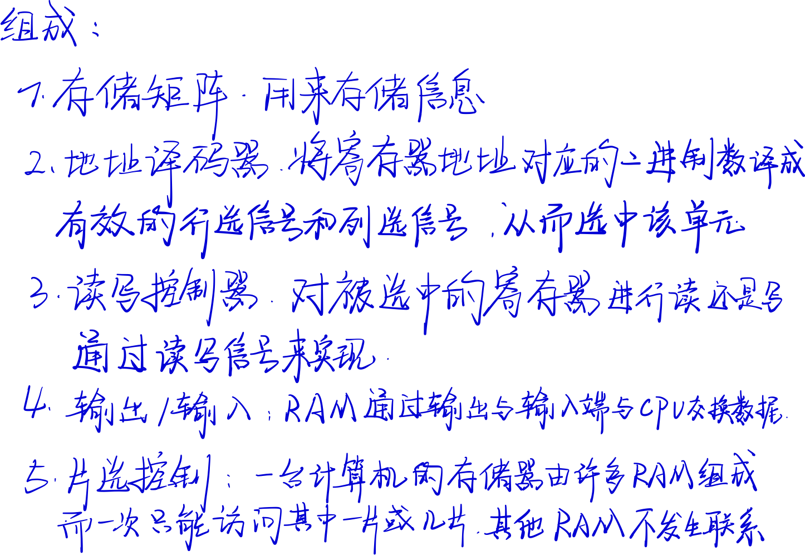
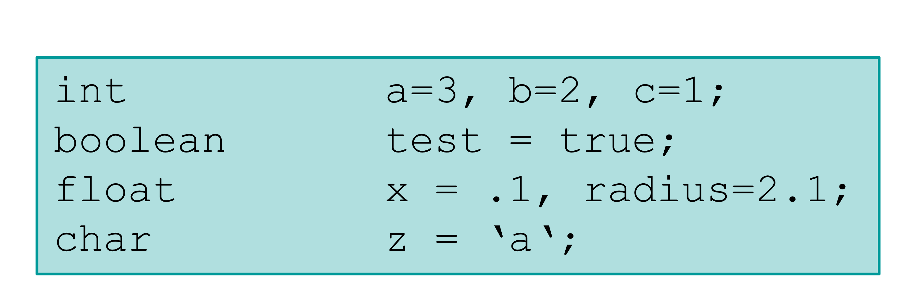

# 计算机理论 [\>\>](marginnote3app://note/AE39D55F-A0B8-4050-B1F3-1C8C2BF90872)

## 信息的表述Informationrepräsentation und Rechnen im Computer [\>\>](marginnote3app://note/3B44128F-46C4-4041-8DBC-7C3509848E05)

  
计算机的本质是处理数据 Die Tätigkeit des Rechners, die Datenverarbeitung, wird dabei ebenfalls durch Daten gesteuert, nämlich durch die Daten, die die Befehle des Programms codieren.

### 位元和字节 Bits und Bytes [\>\>](marginnote3app://note/0A3C3743-1945-43FC-87AC-C0D20693E001)

Bits
是二进制中的一位，是信息的最小的单位，表示只有两个相等大小的可能性  
Hexziffern 
是个一个4Bits的数组，也是半个Byte，或是称为一个Nibble。它只有16种可能，表示16进制的数。  
  
  
进制系统: Dezimal-System 十进制 Hexadezimal-System 十六进制 Oktalsystem 八进制 Binärsystem 二进制  
Bytes 字节 计算机以位元组的形式进行计算，可为8Bits, 16Bits, 32Bits, 64Bits 一个8Bits的位元组称为Bytes 共有2\^8=256种不同Bytes 一个Bytes可表示一个编码符号 0到255的自然数 -128到127的整数

### 数据大小 Speicherkenngrößen [\>\>](marginnote3app://note/B7741818-F9ED-469C-9575-ABBE0B806FA4)

1 Bits 为基本单位 8Bits=1Byte 16Bits Adressen =\> 64KiB (2\^16 =\> 64\*10\^3) 32Bits Adressen =\> 4GiB (2\^32=\> 4\*10\^9)   
  
  
  
  
  
  
  

### 控制代码 [\>\>](marginnote3app://note/4B4B6935-F090-410D-8663-4C49D3D688BC)

#### ASCII [\>\>](marginnote3app://note/2671C348-E3D1-4B9E-8CE1-721982595E90)

ASCII : American Standard Code for Information Interchange. 美国信息交换标准代码 定义了128个字符，其中33个无法显示，95个可显示  
  
  
Die ASCII-Codes von 1 bis 26 entsprechen dabei den Kombinationen Ctrl-A bis Ctrl-Z auf einer Tastatur 
使用Ctrl进行控制 
• Bei der ASCII-Codierung werden nur die ersten 7 Bits eines Byte genutzt. • Das letzte Bit verwendete man früher als Kontrollbit für die Datenübertragung. 
ASCII只使用前7位，最后一位用于控制数据传输  
Von der „International Standardization Organization“ (ISO) wurden verschiedene ASCII-Erweiterungen normiert, die diese Zeichen ganz oder teilweise nutzen. In Europa ist dazu die ASCII-Erweiterung Latin-1 nützlich, die durch die Norm ISO8859-1 beschrieben wird.

#### Unicode [\>\>](marginnote3app://note/98962A3E-2E7B-4679-BCA3-8C035721756D)

Dieser neue Zeichensatz heißt Unicode und verwendet eine 16-Bit-Codierung, kennt also maximal 65536 Zeichen. Unicode
是16位的，可记录65536种字符 统一码联盟，他们由Xerox、Apple等软件制造商于1988年组成，并且开发了Unicode标准（The Unicode Standard —Unique, Universal, and Uniform）。 Die ersten 128 Unicode-Zeichen sind identisch mit dem ASCII- Code, die nächsten 128 mit dem ISO8859-1 Latin 1 Code. 前128种Unicode是ASCII，再之后的128种字符是Latin-1 Unicode wurde vom Unicode-Consortium (www.unicode.org) definiert. Dieses arbeitet ständig an neuen Versionen und Erweiterungen dieses Zeichensatzes. Unicode编码点分为17个平面（plane），每个平面包含216（即65536）个码位（code point），而第一个平面称为“基本多语言平面”（Basic Multilingual Plane，简称BMP），其余平面称为“辅助平面”（Supplementary Planes）。其中“基本多语言平面”（0\~0xFFFF）中0xD800\~0xDFFF之间的码位作为保留，未使用。

#### UCS [\>\>](marginnote3app://note/F5D21AC3-476D-4E54-AD29-32981F9446A2)

UCS Universal Character Set 通用多八位编码字符集 是由ISO制定的ISO10646标准制定的标准字符集 国际标准化组织（ISO），他们于1984年创建ISO/IEC JTC1/SC2/WG2工作组，试图制定一份“通用字符集”（Universal Character Set，简称UCS），并最终制定了ISO 10646标准。 Unter der Norm ISO-10646 wurde Unicode als Universal Character Set (UCS) international standardisiert. UCS-4 在Unicode与ISO 10646合并之前，ISO 10646标准为“通用字符集”（UCS）定义了一种31位的编码形式（即UCS-4），其编码固定占用4个字节，编码空间 0x00000000\~0x7FFFFFFF UCS-4有20多亿个编码空间，但实际使用范围并不超过0x10FFFF，并且为了兼容Unicode标准，ISO也承诺将不会为超出0x10FFFF的UCS-4编码赋值。 UCS-2 ISO 10646标准为“通用字符集”（UCS）定义了一种16位的编码形式（即UCS-2），其编码固定占用2个字节，它包含65536个编码空间（可以为全世界最常用的63K字符编码，为了兼容Unicode，0xD800-0xDFFF之间的码位未使用）。

#### UTF [\>\>](marginnote3app://note/9E74C331-139D-4708-999D-95ADA99E638E)

UTF-32 ISO也承诺将不会为超出0x10FFFF的UCS-4编码赋值。由此UTF-32编码被提出来了，它的编码值与UCS-4相同，只不过其编码空间被限定在了0\~0x10FFFF之间。因此也可以说：UTF-32是UCS-4的一个子集。  
UTF-16 与UCS-2一样，它使用两个字节为全世界最常用的63K字符编码，不同的是，它使用4个字节对不常用的字符进行编码。UTF-16属于变长编码。 另外，UTF-16还可以利用保留下来的0xD800-0xDFFF区段的码位来对“辅助平面”的字符的码位进行编码，因此UTF-16可以为Unicode中所有的字符编码  
 UTF-8 在UTF-8编码中，ASCII码中的字符还是ASCII码的值，只需要一个字节表示，其余的字符需要2字节、3字节或4字节来表示。 UTF-8 ist eine Mehrbyte-Codierung. 7-Bit ASCII-Zeichen werden mit einem Byte codiert, alle anderen verwenden zwischen 2 und 6 Bytes. Die Kodierung erfolgt nach den folgenden Prinzipien: • Jedes mit 0 beginnende Byte ist ein Standard 7-Bit ASCII Zeichen. Jedes mit 1 beginnende Byte gehört zu einem aus mehreren Bytes bestehenden UTF-8 Code. • Besteht ein UTF-8 Code aus n \>2 Bytes, so beginnt das erste Byte mit n vielen 1- en, und jedes der n-1 Folgebytes mit der Bitfolge 10. UTF-8的编码规则： (1) 对于ASCII码中的符号，使用单字节编码，其编码值与ASCII值相同（详见：U0000.pdf）。其中ASCII值的范围为0\~0x7F，所有编码的二进制值中第一位为0（这个正好可以用来区分单字节编码和多字节编码）。 (2) 其它字符用多个字节来编码（假设用N个字节），多字节编码需满足：第一个字节的前N位都为1，第N+1位为0，后面N-1 个字节的前两位都为10，这N个字节中其余位全部用来存储Unicode中的码位值。   
  
  
  

### 进制转换 [\>\>](marginnote3app://note/A81F018F-1523-4D6B-BD28-4106014884BC)

#### 二进制数 Binärdarstellungen [\>\>](marginnote3app://note/F06CFD31-EB50-4A25-844E-C7AB1B6136D7)

Für das Binärsystem hat man anstelle der Ziffern 0 ... 9 nur die beiden Ziffern 0 und 1 zur Verfügung, daher stellen die einzelnen Ziffern einer Binärzahl die Koeffizienten der Potenzen von 2 dar.  
Mit 4 Bits können wir auf diese Weise die 16 Zahlen von 0 bis 15 erfassen, • mit 8 Bits die 256 Zahlen von 0 bis 255, • mit 16 Bits die Zahlen von 0 bis 65535 und • mit 32 Bits die Zahlen von 0 bis 4 294 967 295.

##### 二进制数计算 [\>\>](marginnote3app://note/9557F242-618C-4E44-9407-8CF7FF0DF4DB)

  
  
  
  

###### 原码，反码，补码 [\>\>](marginnote3app://note/F701D6CE-CA24-4BE4-B7B7-5D1BFAD55EE9)

机器数: 一个数在计算机中的二进制表示形式, 叫做这个数的机器数。 机器数是带符号的，在计算机用一个数的最高位存放符号, 正数为0, 负数为1 So bietet sich zunächst eine Darstellung an, in der das erste Bit das Vorzeichen repräsentiert (0 für '+') und (1 für '-') und der Rest den Absolutwert. Diese Darstellung nennt man die Vorzeichendarstellung  
真值: 因为第一位是符号位，所以机器数的形式值就不等于真正的数值。 所以，为区别起见，将带符号位的机器数对应的真正数值称为机器数的真值。 0000 0001的真值 = +000 0001 = +1 1000 0001的真值 = –000 0001 = –1  
原码: 原码就是符号位加上真值的绝对值, 即用第一位表示符号, 其余位表示值. 比如如果是8位二进制: [+1]原 = 0000 0001 [-1]原 = 1000 0001 第一位是符号位. 因为第一位是符号位, 所以8位二进制数的取值范围就是: [1111 1111 , 0111 1111] 即 [-127 , 127]  
反码: Einerkomplement 反码的表示方法是: 正数的反码是其本身 负数的反码是在其原码的基础上, 符号位不变，其余各个位取反. [+1] = [00000001]原 = [00000001]反 [-1] = [10000001]原 = [11111110]反 可见如果一个反码表示的是负数, 人脑无法直观的看出来它的数值. 通常要将其转换成原码再计算. • Zur Vorzeichenumwandlung (+→- bzw. -→+) wird jedes Bit invertiert.  
3\. 补码 Zweierkomplementdarstellung 补码的表示方法是: 正数的补码就是其本身 负数的补码是在其原码的基础上, 符号位不变, 其余各位取反, 最后+1. (即在反码的基础上+1) [+1] = [00000001]原 = [00000001]反 = [00000001]补 [-1] = [10000001]原 = [11111110]反 = [11111111]补 对于负数, 补码表示方式也是人脑无法直观看出其数值的. 通常也需要转换成原码在计算其数值. Auch bei den Zweierkomplementzahlen stellt das erste Bit das Vorzeichen dar. Zweierkomplement = Einerkomplement + 1   
  
  
补码计算: 首先给两个补码复原为两个带符号位的原码进行加法 之后得到的是结果的补码，再将这个补码进行复原就是结果，且这个结果为带符号的原码。根据要求，保留原码或补码

##### 表达小数 [\>\>](marginnote3app://note/DF4B69E7-814F-46B4-B8BC-281C79CC72C3)

###### 定点数 Festkommadarstellung [\>\>](marginnote3app://note/F94FA1BF-4EE8-4E3B-97DC-494D39FA5AC4)

所谓定点数，就是指小数点的位置是固定的，约定小数点在某一个位置上，因此，机器在处理定点数时，并不存储它的小数点。使用定点数的机器，被称为定点机。当然了，现代计算机一般只要有运算部件，都会提供对定点数运算的支持。 虽然理论上，定点数的小数点的位置可以任意规定，但通常只会用定点数表示纯小数或整数，当表示纯小数时，小数约定在上一篇文章里反复提及的符号位和数值部分之间，同理，表示整数时，则在数值部分的后面。  
• Dezimalsystem → Binärsystem – Ebenfalls mit div und mod利用整除和乘法 – Getrennte Berechnung von Vor- und Nachkommateil – Vorkommateil: Division durch 2 mit Rest 小数点之前的除余法，余数为二进制代码 – Nachkommaanteil: Division→Multiplikation! (wegen negativer Exponenten) 小数点后的乘2, 每够一个1,就取尾数，直到没有尾数也就是0.5\*2=1.但最多不超过范围 16Bits

###### 浮点数 Fließkommazahlen [\>\>](marginnote3app://note/D35704C1-CA40-4A0C-8034-FA284A76938C)

Große Zahlen: Wunsch nach größerem Wertebereich – Nachkommateil nicht so relevant 很大的数范围很大，因此小数点之后的数没那么重要，数位主要用于填充小数点之前的数 Kleine Zahlen: Wunsch nach mehr Nachkommastellen – Dafür ist vor dem Komma nicht so viel Spielraum 很小的数范围很小，因此小数点之后的数影响精确性，数位用于填充小数点后的部分   
 • Gleitpunktzahlen bestehen nach dem Gesagten aus drei Komponenten: • dem Vorzeichenbit: v 符号 Das Vorzeichenbit v gibt an, ob die vorliegende Zahl positiv oder negativ ist. • dem Exponenten: e 指数 Der Exponent e ist eine Binärzahl, zum Beispiel im Bereich -64 bis +63, die angibt, mit welcher Potenz einer Basiszahl b die vorliegende Zahl zu multiplizieren ist. • der Mantisse: m 尾位 Die Mantisse besteht aus Binärziffern m1....mn und wird wie folgt interpretiert: m(1)\*2\^-1 +m(2)\*2\^-2 + ... +m(n-1)\*2\^-(n-1) +m(n)\*2\^-n • Meist wird b=2 als Basiszahl verwendet. Normierte Gleitpunktzahlen haben den Vorteil, dass die Mantissenbits optimal ausgenutzt werden, da keine überflüssigen Nullen gespeichert werden müssen. Eine normierte Gleitpunktzahl mit Vorzeichen v, Mantisse m1....mn und Exponent e stellt also folgenden Zahlenwert dar.: (-1)\^v\*(1+m(1)\*2\^-1 +m(2)\*2\^-2 + ... +m(n)\*2\^-n)\*2\^e

1.  IEEE754 [\>\>](marginnote3app://note/8ED8830A-1CF0-4F7E-9EA1-1E6DA40EB929)

    IEEE电子电气工程师协会决定采用非常接近KCS的方案作为IEEE的标准浮点格式  
    单精度浮点数 32-Bits-Fließkommazahlen nach IEEE754   
      
      
      
      
      
      
    Daher Sonderfälle e=0 und m≠0 Zahl ist denormalisiert (0,m) e=0 und m=0 Darstellung der Zahl 0 e=1111 1111 und m≠0 NaN (Not a Number) e=1111 1111 und m=0 Unendlich (Infinity, je nach Vorzeichen +/-)   
      
      
    1\. Dezimalzahl in Festkommabinärzahl umrechnen (mit 23 Binärstellen hinter erster 1) 小数点前的通过除余2得到二进制代码，小数点后的通过乘2得到二进制代码，补充小数点后的部分，使总共达到23位，符号不管。 2. Verschiebe Komma um n Stellen nach, sodass Zahl die Form 1,... bekommt 移位小数点到第一个1的后面，且移了n位 3. Schreibe das Vorzeichenbit (1 falls negativ, 0 sonst) 符号位v，负数位1,正数为0 4. Rechne e=n+127 und schreibe binäre Darstellung von e 指数e部分 是 n+127的二进制数 5. Schreibe m (Bitfolge hinter dem Komma aus Schritt 2) 把移位后的小数点后面的部分作为m部分

#### 八进制和十六进制Oktal- und Hexdezimalsystem [\>\>](marginnote3app://note/D935397F-B426-422F-BB54-CAFB9B28F766)

Gruppieren wir jeweils drei Ziffern einer Binärzahl und ordnen jeder Dreiergruppe die entsprechende Oktalziffer zu, so erhalten wir die Oktaldarstellung der Zahl.

#### 进制转换 [\>\>](marginnote3app://note/9F3CD925-4ADC-4473-834E-58921A303AE0)

In der Informatik bezeichnet man die Operation des exakten Dividierens mit div und die Operation, die zwei Zahlen den Divisionsrest zuordnet, mit mod.  
Wir wollen die Binärdarstellung einer natürlichen Zahl z finden. • Die Zahl z wird fortgesetzt durch 2 geteilt. 除2 • Dabei ergeben die Reste nacheinander gerade die Ziffern der Darstellung von z im Zweiersystem. Die Binärziffern entstehen dabei von rechts nach links. 余数进行排序，倒序为二进制  
Für eine Zahl z im Dezimalsystem gilt – z mod 10 liefert die letzte Ziffer der Zahl – z div 10 erhält man durch Streichen der letzten Ziffer  
Wir wollen die Oktaldarstellung einer natürlichen Zahl z finden. • Die Zahl z wird fortgesetzt durch 8 geteilt. 除8 • Dabei ergeben die Reste nacheinander gerade die Ziffern der Darstellung von z im Oktalsystem von rechts nach links. 余数进行排序，倒序为八进制

## 硬件 Hardware [\>\>](marginnote3app://note/AC1BF0B8-4073-4D1D-B886-25A7606ADDBB)

中央处理器 Der Zentralprozessor (Central Processing Unit, CPU) führt fortwährend Befehle aus, das sind arithmetische/ logische Operationen oder Anweisungen zur Steuerung der zeitlichen Reihenfolge anderer Befehle.  
运行储存器 Der Arbeitsspeicher (Speicherwerk) enthält Programm und Daten, besteht aus durchnummerierten Zellen (Bytes, 1 Byte = 8 Bit), Adresse: Nummer einer Zelle  
外接设备 Die Peripherie: Plattenspeicher, Drucker, Bildschirm, ...  
连接系统 Der Bus verbindet Prozessor, Speicher und Peripherie zur Übertragung von Bits & Bytes  
程序 Programm in Maschinensprache: Folge von Befehlen, wird aus dem Speicher gelesen

### 计算机外部 [\>\>](marginnote3app://note/E278DDF5-FC86-4B4D-82FE-47428519BAA3)

### 计算机内部 [\>\>](marginnote3app://note/605D39E2-6FA6-47A9-AF3C-CCDFB9CF26AA)

### 主板 [\>\>](marginnote3app://note/DC9C69F1-CED2-4D1D-97F0-F0446F267C8D)

#### CPU [\>\>](marginnote3app://note/BCF0AE53-C2F5-44A9-B98A-B4FFF96E57E0)

数据处理 Wesentliche Aufgabe: Verarbeitung von Daten   
Heutige Rechner haben meist mehrere gleichberechtigte CPUs (multi-core) sowie zusätzliche Hilfsprozessoren z.B. zur grafischen Datenverarbeitung (GPU).  
任务: Arithmetic-Logical Unit (ALU): Ausführung mathematischer und logischer Operationen 执行数学和逻辑算法 Register: sehr schnelle Speicherzellen, die direkt mit der ALU verbunden sind 快速储存，寄存。 直接连接ALU部分  
执行命令: CPUs führen zur Erledigung ihrer Aufgaben Befehle aus.  
Jede CPU hat ihren eigenen Befehlssatz, der vor allem Befehle zum Datentransfer und Operationen auf Speicherzellen umfasst. 每个CPU都有自己的命令语句，用在储存元上的数据传输和运算

##### 程序运行 [\>\>](marginnote3app://note/6759F62F-9160-4D08-B6F4-1A43F8B7FCA1)

Um ein Programm auszuführen, muss es zunächst in den Speicher geladen werden. 一个程序运行，首先需要从储存器中获取数据。  
Von dort holt sich die CPU dann einen Befehl nach dem anderen und führt ihn aus. CPU需要先获取再执行  
Normalerweise wird ein Programm sequentiell ausgeführt, also ein Befehl nach dem anderen in der Reihenfolge, wie es gespeichert ist. 程序是一个接一个按顺序进行的

#### 储存器 [\>\>](marginnote3app://note/C0FD9F9B-811F-479C-BF2E-FDCE0E6952C0)

Im Hauptspeicher oder Arbeitsspeicher werden Programme und Daten abgelegt. 主内存或运存中储存程序和数据 Der Hauptspeicherinhalt ändert sich ständig; dient der Arbeitsspeicher nicht der permanenten Speicherung von Daten. 主存在持续变化，运存也不会持久的保存数据 Bei praktisch jedem Computer verlieren die Hauptspeicherzellen beim Ausschalten ihre Daten. 当切断数据时，计算机将失去主存  
Eine Zelle kann ein Bit speichern, allerdings sind die Zellen Byte-weise organisiert – man kann also immer nur auf ein ganzes Byte zugreifen. 一个储存元可以储存1Byte  
Jedes Byte hat eine eigene Nummer, die als Adresse bezeichnet wird. 每个Byte都有一个数字，描述为Adress  
Auf jedes Byte des Speichers kann direkt zugegriffen werden, deshalb auch RAM = Random Access Memory. 每个Byte可以直接被直接获取  
Daten im Hauptspeicher gehen verloren, wenn sie nicht ca. alle 15 μs aufgefrischt werden. 主存上的数据会丢失，如果15微秒内没有刷新  
  

##### ROM [\>\>](marginnote3app://note/90CECB25-F83A-4F74-AAEC-C988DD54F315)

  
  

##### RAM [\>\>](marginnote3app://note/01EA88A0-EB87-4D93-B027-0EE0C075C9D0)

  
  
  
  

##### 磁盘 Magnetplatten [\>\>](marginnote3app://note/5E5F2F42-16B2-41C0-9A06-538F0C3AEDDB)

Eine Aluminium- oder Kunststoff- scheibe, die mit einem magneti- sierbaren Material beschichtet ist, dreht sich unter einem Schreib- Lese-Kopf. 在铝或人工材料的圆盘上涂磁材料  
Der Schreiblesekopf ist beweglich und kann prinzipiell über jeder Position der Platte platziert werden. 读写头是可移动的，原则上可以到达光盘上的每个地方   
Die Platte ist dazu in Spuren (Tracks) und die Spuren in Sektoren eingeteilt. 盘由不同的轨和不同的扇区划分  
  

##### 硬盘 Festplatten [\>\>](marginnote3app://note/4A20E598-A56E-4A78-8703-14D72991B198)

• Eine Festplatte enthält in einem luftdichten Gehäuse einen Stapel von Platten. 硬盘在一盘密封的盘组中 • Abstand des Schreib-Lese-Kopfes von der Platte oft weniger als 0,1 μm! Das ist deutlich weniger als der Durch- messer eines Staubkorns, d.h., absolute Staubfreiheit muss gewährleistet sein. 盘与盘之间的距离小于0.1微米 • Magnetplatten werden immer mehr von SSD-Platten abgelöst (Solid State Disks, keine beweg- lichen Teile mehr). 磁盘渐渐由固态硬盘SSD代替  
  

##### 光驱 Optische Laufwerke [\>\>](marginnote3app://note/6D957083-2505-4D5D-8025-F3725D862617)

• Optische Platten wie CDs und DVDs werden mit einer bestimmten Legierung beschichtet. 光盘表面有特定的合金涂层 • In diese Schicht werden bei der Herstellung Rillen gepresst. 有压制的槽 • Auf die dazwischenliegenden Spuren werden Daten durch den so genannten Brennvorgang in Form von Löchern gespeichert. 数据由表面的小孔储存 • Gelesen werden die Daten mit Hilfe eines Laserstrahls. 通过激光束用于读取数据 • Lesen und Schreiben solcher Platte ist relativ fehleranfällig, weswegen komplexe Redundanzverfahren verwendet werden. 数据在轨迹上被烧成小孔保存

##### 闪存 Flash-Speicher [\>\>](marginnote3app://note/9B4845E2-842B-4679-8D3B-4F349DD36994)

• Bei einem Flash-Speicher werden Bits als elektrische Ladungen auf einem Floating Gate eines Feldeffekttransistors gespeichert. 数据被电荷在电容器中保存 • Ein Zustand bleibt erhalten und kann nur durch Anlegen einer hohen Spannung geändert werden. • Flash-Speicher kann wieder beschrieben werden, allerdings nur in großen „Portionen“, so dass man clevere Software benötigt, um z.B. eine Datei abzuspeichern.

## 软件 Software [\>\>](marginnote3app://note/044E0170-60F7-445C-AD54-E03948E1C235)

### 接口与驱动 [\>\>](marginnote3app://note/8AC815F4-A1A5-4787-AE68-5EF1B1DE43EC)

Schnittstelle = Konvention, die eine Verbindung verschiedener Bauteile festlegt. 接口  
Nun benötigt man noch einen Übersetzer, der die Befehle der allgemeinen Schnittstelle in die spezifischen Befehle des Geräts übersetzt. Diese Software heißt Treiber. 驱动程序，程序翻译为硬件语言，发出命令  
  

### 系统 [\>\>](marginnote3app://note/90DBC91C-53C0-4ECA-8160-98841DB3D61C)

#### 操作系统 [\>\>](marginnote3app://note/8997FCDA-B233-4917-823B-75745F9899DC)

Das Betriebssystem verwaltet die Ressourcen eines Rechnersystems und teilt sie insbesondere den Benutzern zu. 管理资源 • Wesentliche Aufgaben: Prozessverwaltung 过程管理 Speicherverwaltung 储存管理 Dateiverwaltung 数据管理

#### 服务系统 [\>\>](marginnote3app://note/8B51C52F-662F-428E-BC4B-4BBAB4073C78)

Bediensystem = Schnittstelle des Betriebssystems zu einem Benutzer 操作系统和使用者之间的接口 • Entwicklung: – Zunächst Kommandozeile (Unix, MS-DOS etc.) – Heute dominierend: fensterbasierte Systeme wie Windows, Gnome, etc. – Im Kommen: sprach- und gestenbasierte Steuerung

## 算法 Algorithmus [\>\>](marginnote3app://note/3792FE49-A5AE-41E0-9AF6-5CCDFF879907)

Algorithmen sind Handlungsanweisungen 是行为语句 Elementare Aktionen werden als bekannt vorausgesetzt 元素是已知条件 Ein Algorithmus beschreibt eindeutig – Reihenfolge – Bedingungen der Ausführung dieser elementaren Aktionen 明确的写出了执行顺序和条件

### 详述 Spezifikation [\>\>](marginnote3app://note/CC9802B1-C3A9-4683-A3EC-976A1EF16B45)

Eine Spezifikation ist eine vollständige, detaillierte und eindeutige Problembeschreibung. vollständig : Alle relevanten Rahmenbedingungen müssen angegeben werden 所有有关条件都应给出 detailliert: Es muss klar sein, welche Hilfsmittel verwendet, insbesondere welche Grundaktionen vorausgesetzt werden können. 明确给出需要哪些基本行为 eindeutig: Für den Verwender muss klar sein, was das Programm tut - aber nicht, wie die Lösung beschaffen ist. 应给出程序应该做什么，而不是如何解决问题

### 性质 [\>\>](marginnote3app://note/5C4CD507-D19A-4813-87BD-B9CE84027E31)

schrittweise: Die Ausführung erfolgt in definierten Schritten. 有明确的步骤 detailliert: Jeder nicht weiter erklärte Schritt besteht aus einer elementaren, in einer gegebenen Umgebung ausführbaren Grundaktion. 在环境中详细的给出组成部分 explizit: Zu jedem Zeitpunkt muss definiert sein, welche Schritte als nächste auszuführen sind. Der Algorithmus kann daher von einem Menschen oder von einer Maschine durchgeführt werden. 每个时间点都知道下一步应该做什么 korrekt: Von einem Algorithmus erwartet man in der Regel, dass er die betreffende Problemstellung - gegeben in Form einer Spezifikation - erfüllt. 正确的满足问题 terminierend: Oft wird verlangt, dass ein Algorithmus nach endlich vielen Schritten terminieren (= enden) muss. Es gibt aber auch nicht- terminierende Algorithmen, die durchaus sinnvoll sind. 在有限的步骤中 deterministisch: Ein Algorithmus wird deterministisch genannt, wenn es zu jeder möglichen Eingabe genau einen, vorher bestimmbaren Ablauf gibt. 在输入值之前，就有确定的流程 determiniert: Ein Algorithmus heißt determiniert, wenn für jede mögliche Eingabe das Resultat eindeutig bestimmt ist. 每个输入值都可以得到确定的结果

## 数据结构 Datenstrukturen [\>\>](marginnote3app://note/21EF5145-D578-4C54-ACC3-49CC39C5C4FF)

### 数据 Daten [\>\>](marginnote3app://note/3AC32EC5-8C30-439D-ABDA-AE7B8F35E0A3)

Daten = Objekte, mit denen ein Programm umgehen soll Ein Datentyp ist eine Menge gleichartiger Daten, auf denen eine Sammlung von Operationen definiert ist. 一个数据类型代表一个同种数据的集合 Eine Operation ist dabei eine Verknüpfung, die einer festen Anzahl von Eingabedaten ein Ergebnis zuordnet. 运算是输入数据与结果的连接   
Zur Definition benötigt man drei Komponenten: – die Menge an möglichen Werten (Konstanten dabei oft als nullstellige Operationen beschrieben) – die Menge an Operationen – eine Definition der Ergebnisse der Operationen, d.h., welches Ergebnis bei welcher Parametereingabe herauskommt  
数据类型 Datentypen Zusammenfassung von Wertebereichen und Operationen zu einer Einheit 是值域和运算的总结 抽象数据类型 Abstrakter Datentyp (ADT) Schwerpunkt liegt auf der Spezifizierung der Eigenschaften in Bezug auf ihre jeweilige Semantik 意义在于，他并不是一个具体的真正意义的数，而是一个模型，我们为了把事物程序化，就把他看作是一个数据。但他不是数字那么简单。 例如: 关联数组，复数，容器，双端队列，列表，优先队列，队列，堆栈，字符串，数 具体数据类型 Konkreter Datentyp (KDT) – Schwerpunkt liegt auf der konkreten Umsetzung in Bezug auf die algorithmische Implementierung – Primitive Datentypen: int, float, char, etc. 这个是真正意义上的数据。 复杂数据类型 Komplexe Datentypen (auch Datenstrukturen genannt)

#### 表 Liste [\>\>](marginnote3app://note/674C2D72-61EE-48F9-8EA5-EBBB90D4CF6A)

#### 堆栈 Stack/Keller [\>\>](marginnote3app://note/7D3C4975-4625-43FA-BD33-0B4192D4CF08)

Datenstruktur, bei der nur auf das „oberste“ Element zugegriffen werden kann 一种数据结构，仅在表尾进行插入或删除的线性表。 – Last-In-First-Out (kurz LIFO)后进先出 – Analogie: Stapel von Tellern oder Tabletts  
Operationen push(x,s) Legt Element x auf den Stapel s 进栈 top(s) Liefert das „oberste“ Element von Stapel s观察 pop(s) Entfernt das „oberste“ Element von Stapel s出栈 按照后进先出的原则，储存先进入的数据被压入栈底，最后的数据留在栈顶。需要读数据时，从栈顶弹出数据  
  
  
  
  
  

#### 队列 Warteschlange [\>\>](marginnote3app://note/D6C48697-ACA7-4020-B7F1-1282D1FBB718)

• Datenstruktur, bei der an einem Ende eingefügt und am anderen gelesen oder gelöscht werden kann 只允许在表的前端进行删除，在表的后端进行插入 – First-In-First-Out (kurz FIFO)先进先出 – Analogie: Warteschlange an der Kasse  
 Operationen enQuene(q,x) Fügt Element x an das Ende der Warteschlange q an 在队尾插入 front(q) Liefert das erste Element von Warteschlange q deQuene 检查(q)LiefertdieWarteschlangeohnedasersteElement在队头删除  
  
  
  

#### 集合 Menge (Set/Bag) [\>\>](marginnote3app://note/0629413B-BDD0-47B8-B0AB-ADE002FFAC7E)

Datenstruktur zum Speichern von Elementen, bei der jedes Element,关于元素的保存 1. nur einmalig vorkommen kann (Set) 一次出现 2. mehrmalig vorkommen kann (Bag) 多次出现   
Operationen – insert(x,s) FügtElementxdemSetshinzu 填入数据 – delete(x, s) Entfernt Element x aus dem Set s 删除数据  
  
  
  

## 命令语言 Grundlagen imperativer Sprachen [\>\>](marginnote3app://note/6838629E-79B2-4FDA-BC2E-6BDA6928D7CE)

### 声明变量 Deklaration von Variablen [\>\>](marginnote3app://note/6D62D020-4508-445A-A150-428FEE8438D3)

In den meisten Programmiersprachen müssen Variablen vor ihrer Benutzung deklariert werden. • Auf diese Weise teilt man dem System mit, welche Variablen man benötigt und von welchem Datentyp die Werte sein sollen. • Jede Programmiersprache hat eine eigene Syntax für die Deklarationen (hier Java). • Zweck: – Der Compiler weiß schon zur Compile- Zeit, wie viel Speicher er reservieren muss. – Der Compiler kann die Anordnung im Speicher vorab bestimmen. – Die Deklaration hilft aber vor allem dem Programmierer, Fehler zu vermeiden.  
  

### 初始化变量 Initialisierung [\>\>](marginnote3app://note/037C54C6-CC7F-4630-AC57-834C83E966C6)

• Es ist guter Stil und sehr sinnvoll, Variablen bereits bei ihrer Deklaration einen Wert zuzuweisen. • Tut man dies nicht, steht in dem entsprechenden Speicherplatz irgendein zufälliger Wert. Das ist eine häufige Fehlerursache. • Diesen Vorgang nennt man Initialisierung der Variablen. • Beispiel Java:  
  

### 状态 Zustand [\>\>](marginnote3app://note/7B7C0E99-59A5-4E69-A716-AC34A6FB8F01)

### 输出 Ausdruck [\>\>](marginnote3app://note/C940DC44-ABED-4B6E-89A2-39946275F8D5)

• Variablen bezeichnen im Prinzip Werte von bestimmten Datentypen. • Man kann Variablennamen mit Operatoren kombinieren und erhält dann Ausdrücke.  
  
  
• Jeder Ausdruck bezeichnet ein Element einer Datenstruktur, also einen Wert. • Wenn er Variablen enthält, dann hängt der Wert von den Variablen ab. Zur Ausführung eines Programmes gehört es dazu, solche Ausdrücke auszuwerten, um den Wert zu ermitteln und entsprechend weiterzuverwenden. • Für einen Ausdruck t interessiert uns also 𝜎 𝑡 .

### 函数 Funktionsdefinitionen [\>\>](marginnote3app://note/D41ED5E1-073B-4A65-8F4C-5B07212107E7)

• Zusätzlich zu den bestehenden Operatoren kann man in den meisten Programmiersprachen neue Funktionen auf den Daten definieren. • In den meisten Sprachen besteht eine Funktionsdefinition aus den folgenden Komponenten: – ihrem Namen – einer (möglicherweise leeren) Liste der Parameter (Ein- und Ausgabe) – dem Rückgabewert bzw. seinem Typ (kann auch fehlen) und – der Beschreibung des Algorithmus, den die Funktion ausführt  
  

### 配置 Zuweisung [\>\>](marginnote3app://note/2469A729-FF31-4836-B640-DD5AA0831635)

• Zuweisungen = einfachste Anweisungen zur Veränderung des Speichers 用简单的语句，改变储存器 • Wirkung: Änderung des Wertes einer einzigen Variablen 改变一个单独的变量的值 • Sie bestehen aus einer Variable v, einem Ausdruck t und einem Zuweisungszeichen. Eine Zuweisung funktioniert nur, wenn der auf der rechten Seite berechnete Wert in der links stehenden Variable gespeichert werden kann. • Beide müssen also vom selben Typ sein (oder in den anderen Typ konvertierbar sein).

### 控制结构 Kontrollstrukturen [\>\>](marginnote3app://note/4BAF3881-B95A-4730-921E-BC1B0F47E941)

• Imperatives Programmieren bedeutet, Folgen von Anweisungen zu neuen Anweisungen zu gruppieren. 一步一步的命令计算机 • Die Sprachelemente, die solche Gruppierungen gestatten, nennt man Kontrollstrukturen. 一种程序运行的逻辑 • Die grundlegenden Kontrollstrukturen sind die folgenden, bei Anweisungen A1, A2, ..., An und einem booleschen Ausdruck b:

#### 顺序结构 Sequentielle Komposition [\>\>](marginnote3app://note/393EE5E3-9948-485A-BAF5-D73860C005BC)

#### 分支结构 Alternativanweisung [\>\>](marginnote3app://note/54B133E8-19E6-4CA8-B98A-AA9B8275F92C)

#### 循环结构 Schleife [\>\>](marginnote3app://note/8BED22B1-4571-4FDA-BFDA-00DF2630ADF9)

## 编译器 [\>\>](marginnote3app://note/5F80491A-5DC6-412F-9B4B-54F4EA098626)

编程语言  
  
  
机械语言  
  

